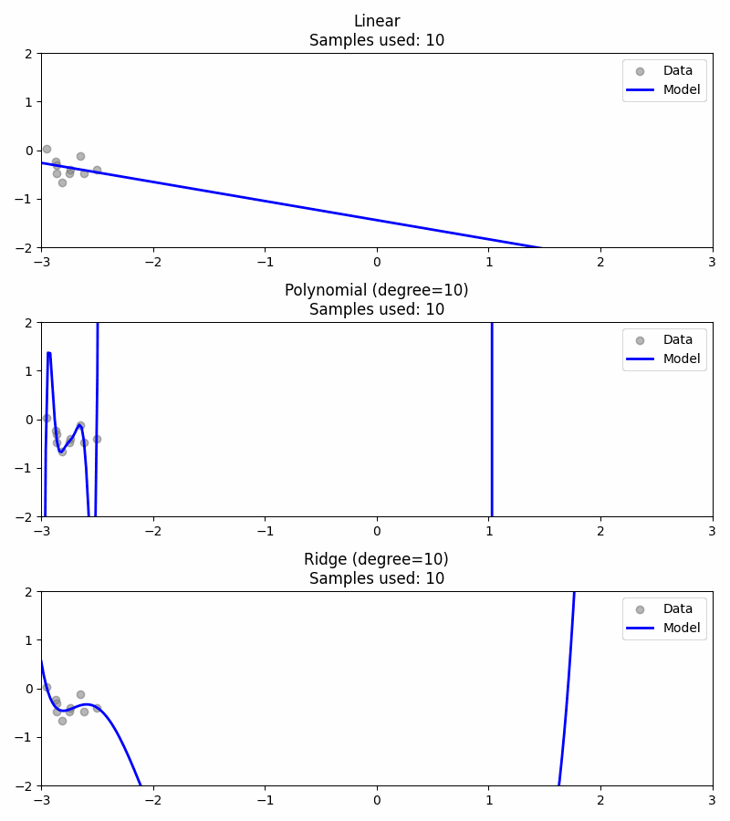

# Regression Models Comparison - Animated Visualization

This project provides a visual comparison between three common regression techniques:

- Linear Regression
- Polynomial Regression (degree=10)
- Ridge Regression (degree=10 with regularization)

All models are trained on the same synthetic, noisy, non linear dataset. The goal is to clearly demonstrate how each model behaves as the training sample size increases, emphasizing concepts such as underfitting, overfitting, and regularization.

The output is an animated GIF that shows how each model adapts over time, allowing for intuitive comparison and better understanding of model complexity.

## Features
- Synthetic data generation for reproducibility
- Frame by frame training visualization
- GIF export and in notebook rendering
- Supports both local and Google Colab environments

## Example Output



## How to Run
1. Clone this repository:
   ```bash
   git clone https://github.com/johnpl765/Regression-Models-Comparison.git
   ```
2. Open the notebook in Jupyter or Google Colab.
3. Run all cells to generate and view the GIF.

## Requirements
```bash
pip install numpy matplotlib scikit-learn imageio
```

## File Structure
- `regression_models_animation.ipynb`: Main notebook with code and comments
- `frames/`: Directory where PNG frames are saved
- `regression_models.gif`: Final animation output

## License
This project is licensed under the MIT License.
